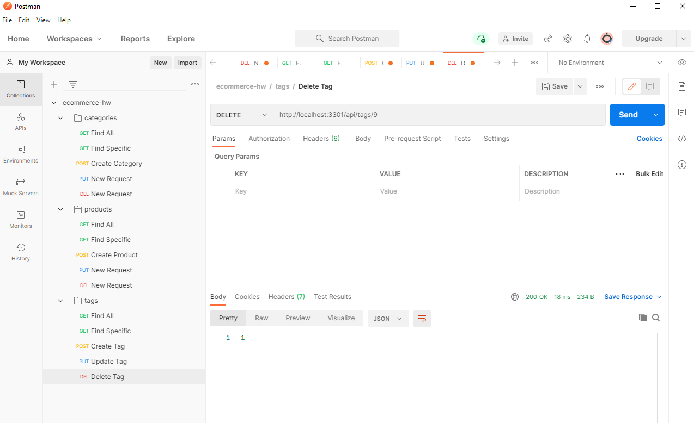

# eCommerce Back-End 

## General 📖
---    
- Author:         Brandon Haley
- Email:          Kyle7286@gmail.com
- Github:         https://github.com/Kyle7286/
- Repo:           https://github.com/Kyle7286/eCommerce-backend
- Video:          https://drive.google.com/file/d/1g1a2X1EEVAhH9qFoOk_WXvdI6xln3XIJ/view

## About/Purpose ❔
---
This application is meant to only be a back-end for a theoretical e-commerce website containing products, tags and category models.  It contains the basic routes for GET, POST, PUT and DEL. This application comes equipped with a `schema` and `seeds` file to get you started with your database which should be mySQL.

## Setup / How to Use
1. Install all depencies
    * `npm i`
2. Configure your .env file
    1. Create a `.env` file in the root directory
    2. Input the following details:
        * DB_USER=
        * DB_PW=
        * DB_NAME=
        * DB_HOST=
        * DB_PORT=  
2. Run Schema to create the database
    * `mysql -u {user} -p`
    * `{password}`
    * `source db/schema.sql`
    * `exit` to go back to bash terminal
3. Run Seeds to inject sample data
    * `node seeds/index`
4. Run the program
    * `node server`
5. Setup your `requests` in `Postman` or `Insomnia`
    * If using `Postman`, for convenience, import the below into `Postman`
        * `./assets/ecommerce-backend.postman_collection.json`
6. Send requests to the routes :)

## Testing
---
No tests | N/A

## Takeaways 🥡
--- 
* Learned to setup models appropriately
* Learned how awesome sequelize is making SQL queries so much easier
* Gained more confidence in building routes keeping try/catch format, and the power of async/await
* Gained more confidence with postman

## Screenshot(s) 📊
---

## Thank you 👍 
---
Thank you for your time reviewing my project/code!